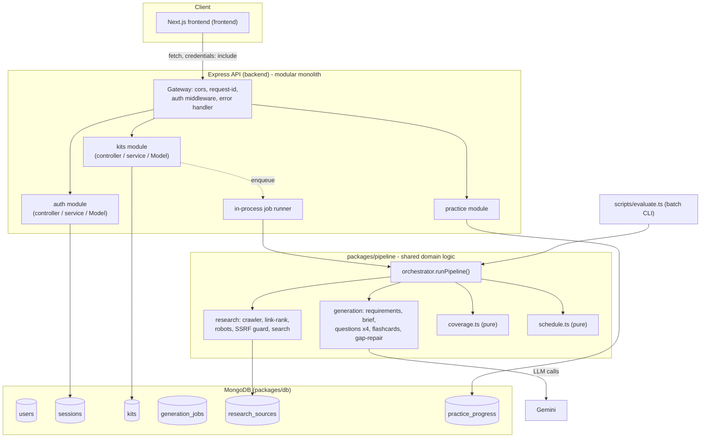
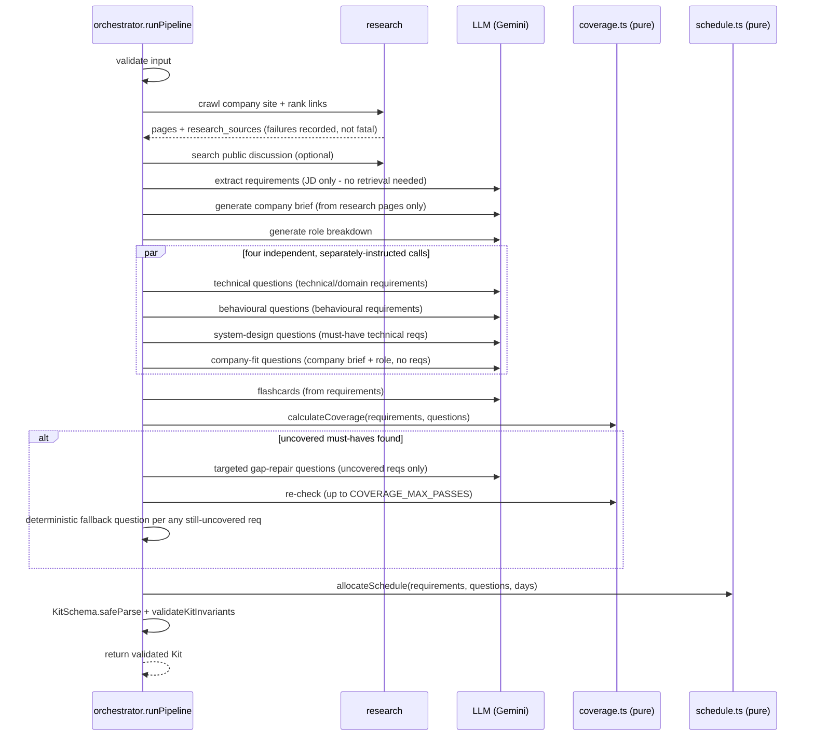

# AI Interview Prep Kit

Turn a job description + a company URL + a days-until-interview number into a structured,
editable, practiceable interview prep kit — researched from the company's own site and
public discussion, generated through a multi-stage pipeline, and validated by deterministic
code rather than trusted to a single LLM call.

Built for the Trao "AI Interview Prep Kit" full-stack assessment.

## Table of contents

- [Tech stack](#tech-stack)
- [Setup](#setup)
- [LLM provider](#llm-provider)
- [Architecture](#architecture)
- [Research pipeline](#research-pipeline)
- [Generation pipeline](#generation-pipeline--sequencing)
- [Coverage algorithm](#coverage-algorithm-deterministic)
- [Schedule algorithm](#schedule-algorithm-deterministic)
- [Edit / regeneration state model](#edit--regeneration-state-model-the-builder)
- [Practice mode](#practice-mode)
- [Creative feature: Weak Spots](#creative-feature-weak-spots)
- [Frontend structure](#frontend-structure)
- [MongoDB design](#mongodb-design)
- [Security](#security)
- [Failure handling & edge cases](#failure-handling--edge-cases)
- [Batch evaluation](#batch-evaluation)
- [Testing](#testing)
- [Environment variables](#environment-variables)
- [Deployment](#deployment)
- [Key trade-offs & known limitations](#key-trade-offs--known-limitations)

## Tech stack

| Layer           | Choice                                                            | Why                                                                                                                                                                         |
| --------------- | ----------------------------------------------------------------- | --------------------------------------------------------------------------------------------------------------------------------------------------------------------------- |
| Frontend        | Next.js (App Router) + TypeScript + Tailwind CSS + TanStack Query | Matches the brief's preferred stack; TanStack Query gives real loading/error/cache state for polling generation progress without hand-rolled state machines                 |
| Backend         | Node.js + Express + TypeScript                                    | Matches the preferred stack; explicit routing/middleware makes the request pipeline (auth → validation → controller → service) easy to reason about and test with Supertest |
| Database        | MongoDB (Mongoose)                                                | Matches the preferred stack; a kit's Appendix A shape is naturally one rich document, which fits MongoDB's document model far better than a relational schema               |
| LLM             | Google Gemini (`gemini-flash-lite-latest`)                                | Genuine free tier, and native `responseMimeType: "application/json"` JSON mode that materially helps enforce the exact kit schema                                           |
| Search          | Brave Search API (optional)                                       | Genuine free tier (2k req/month, no card) for "public discussion of interview process"; the pipeline works honestly without it if `SEARCH_API_KEY` is unset                 |
| Package manager | npm workspaces                                                    | One `npm install` at the repo root builds the whole monorepo; no extra tooling (pnpm/Turborepo) needed at this scale                                                        |

## Setup

### Prerequisites

- Node.js 20+
- A MongoDB connection string (a free [Atlas](https://www.mongodb.com/cloud/atlas) M0 cluster, or a local `mongod`) — **not needed to run the batch evaluator**, only the web API
- A Gemini API key from [Google AI Studio](https://aistudio.google.com/app/apikey) (free tier)
- Optionally, a [Brave Search API](https://brave.com/search/api/) key (free tier)

### Install (clean clone)

```bash
git clone <this repo>
cd Trao-assignment
npm install                 # installs and links every workspace package/app
cp .env.example backend/.env
# edit backend/.env: at minimum set LLM_API_KEY, and MONGODB_URI if running the web app
```

### Run locally

```bash
# terminal 1 - API (Express + in-process job runner), http://localhost:4000
npm run dev:api

# terminal 2 - Frontend (Next.js), http://localhost:3000
# create frontend/.env.local with: NEXT_PUBLIC_API_URL=http://localhost:4000
npm run dev:web
```

### Run the batch evaluator (mandatory entry point)

```bash
npm run evaluate -- --input test-cases/cases.json --output test-cases/output.json
```

This works from a clean clone with only `backend/.env` populated (`LLM_API_KEY` at minimum) —
it never touches MongoDB or sessions. `test-cases/cases.json` includes three cases so one run
demonstrates the range of expected behaviour: a normal JD against the local fixture site (see
[Batch evaluation](#batch-evaluation)), a deliberately thin two-line JD (should stay `"ok"`
with few/no requirements, not padded), and a structurally invalid `company_url` (should come
back `"failed"` with `INVALID_CASE`).

### Tests

```bash
npm test                    # runs every workspace's vitest suite
```

## LLM provider

**Google Gemini, model `gemini-flash-lite-latest`**, via `@google/generative-ai`. Configured entirely
through `LLM_PROVIDER` / `LLM_API_KEY` / `LLM_MODEL` env vars (`packages/config`) — no key is
hardcoded anywhere, and the provider is abstracted behind an `LLMProvider` interface
(`packages/pipeline/src/llm/types.ts`) so a different provider is a config + one new adapter
class away, not a rewrite.

The "lite" variant was picked deliberately over the full `gemini-*-flash` models: a kit
generation run makes roughly 9-11 separate calls (extraction, brief, role, four question
categories, flashcards, and any gap-repair passes), and empirically the full flash preview
models' free tier caps out at **5 requests/minute** while `gemini-flash-lite-latest` allows
**15/minute** — three times the headroom for the same free-tier cost, at a quality level
that's still more than adequate for structured extraction/classification tasks like these
(as opposed to open-ended reasoning). `llm/retry.ts` also parses the `retryDelay` Gemini's
429 response includes and waits that long rather than guessing with pure exponential
backoff, since a short backoff just re-hits the same per-minute quota window for nothing.

## Architecture



### A deliberate deviation: modular monolith, not 5 network services

The brief's diagram draws auth/kit/research/generation as separate services plus a worker.
This repo implements that as **one Express process with clean internal module boundaries**
(`backend/src/modules/{auth,kits,practice}`, `packages/pipeline/{research,generation}`) plus
an **in-process async job runner** instead of a second always-on worker dyno. Reasoning:

1. Free-tier hosts (Render, Railway) reliably keep **one** web service warm; provisioning 5
   would mean cold-starts and inter-service HTTP hops on the critical path of a process that
   already has a strict 15-minute/5-case batch budget.
2. The brief itself says to _"avoid unnecessary synchronous service-to-service calls for
   long-running operations"_ and to prefer Mongo-backed job state over Redis — that's exactly
   what an in-process job runner polling `generation_jobs` gives you, without paying for a
   second service.
3. Separation of concerns (the thing 5 services are really trying to buy you) is achieved
   through **module boundaries and a controller → service → Model layering** instead of
   process boundaries — see the next section.

### Backend layering (MVC-shaped, for an API)

Each module (`auth`, `kits`, `practice`) is split into:

- **Routes** (`*.routes.ts`) — URL → controller wiring only, no logic.
- **Controllers** (`*.controller.ts`) — parse/validate HTTP input (Zod), call the service,
  shape the JSON response envelope. This is the "C" in MVC.
- **Services** (`*.service.ts`) — the business/domain logic and MongoDB queries. Combined
  with the pure mutation functions in `kit-mutations.ts`, this is the "M" (Model) layer.
- There is no server-rendered "View" — this is a JSON API, so the response envelope
  (`{ success, data, requestId }`, built once in `packages/schema`) is the closest analogue.

`packages/pipeline` is deliberately framework-agnostic domain logic (research + generation +
coverage + schedule) reused, unmodified, by both the in-process job runner and the batch CLI.

## Research pipeline

Steps, in order, for a single company URL (`packages/pipeline/src/research/`):

1. **Normalize + validate** the URL (`http`/`https` only).
2. **SSRF guard** (`url-guard.ts`): resolves the hostname and rejects private/loopback/
   link-local ranges (including the `169.254.169.254` cloud-metadata address) — _unless_
   running outside `NODE_ENV=production`, or `EVAL_ALLOW_LOCALHOST=true` is set, which is what
   lets the batch grader point at `http://localhost:8099/acme/` without opening up SSRF
   protection in the deployed app. Re-checked on every redirect hop, not just the first URL.
3. **`robots.txt`** is fetched best-effort and a minimal `User-agent: *` / `Disallow` matcher
   is applied to every discovered link before it's ever fetched.
4. **Homepage fetch** (`fetch-page.ts`): hard timeout, streamed response-size cap, and a
   content-type allowlist (`text/html`, `text/plain`) — enforced while streaming, not after
   reading the whole body.
5. **Parse + extract links** (`html.ts`, Cheerio): visible text is cleaned of `script`/`style`/
   `nav`/`footer`; every same-origin `<a href>` is resolved to an absolute URL.
6. **Deterministic link ranking** (`link-rank.ts`) — _this is the interesting half of the
   brief_. Each discovered link is scored from keyword weights matched against its anchor
   text, URL path, and (once fetched) page title:

   ```
   interview / interviewing   +14        careers / jobs        +10
   how-we-hire                +13        engineering / handbook +7
   hiring                     +12        culture / about        +5
   recruiting                 +8         blog / team             +3
   ```

   Deeper paths get a small penalty. **No fixed path list is ever tried** ("just check
   `/careers`") — the brief explicitly calls out that GitLab and PostHog publish hiring
   process detail at unpredictable paths, and this scoring is what finds those regardless of
   where they live (a handbook page, an engineering blog, a `/how-we-hire` page, etc.).

7. The top-scoring links (up to `MAX_CRAWL_PAGES`, default 6) are fetched with the same
   guards and classified (`careers` / `engineering` / `interview-process` / `about` / `other`).
8. **Public discussion search** (`search.ts`) — an optional Brave Search query for
   `"<company> interview process"` / `"<company> glassdoor interview"`. If no
   `SEARCH_API_KEY` is configured, or the provider errors, this returns `[]` and the pipeline
   proceeds honestly rather than fabricating results.
9. Every fetch attempt — success _or_ failure — is recorded as a `research_sources` row with
   a `retrievalStatus` and a specific failure reason (`TIMEOUT`, `NOT_FOUND`, `SSRF_BLOCKED`,
   `SIZE_EXCEEDED`, `BAD_CONTENT_TYPE`, `BLOCKED_BY_ROBOTS`, `NETWORK_ERROR`). **One failed
   source never aborts the run** — the rest of the pipeline proceeds with whatever was
   retrieved, which is what lets a company with zero discoverable pages still produce an
   honest (thin) kit instead of a hard failure.
10. Per-host rate limiting (`rate-limiter.ts`, a 500ms minimum interval) plus exponential
    backoff with jitter on the LLM/search clients (`llm/retry.ts`) so a 429 from a free-tier
    provider slows the pipeline down instead of crashing it.

## Generation pipeline & sequencing

The kit is never produced by one big prompt. Each stage below is a separate, typed,
Zod-validated call (`packages/pipeline/src/generation/` + `orchestrator.ts`), and each stage's
status (`pending` → `running` → `completed`/`failed`/`skipped`) is persisted to
`generation_jobs` in real time, which is exactly what the frontend's progress screen polls and
renders — there is no fake/simulated progress bar.



Why the sequencing matters (not just "call the model 8 times"):

- **Pasted JD text needs no retrieval** — requirement extraction runs directly off the JD,
  never blocked on the crawler.
- **The company brief is a separate call from question generation**, built only from what
  research actually retrieved — a company with nothing discoverable gets an honestly thin
  brief, not a hallucinated one.
- **A requirement's `kind` routes it to a different call with different instructions**: a
  "5+ years React" (`technical`) requirement only ever reaches the technical-questions call;
  "mentors junior engineers" (`behavioural`) only reaches the behavioural call. They are never
  in the same prompt, so they can't leak each other's framing.
- **A found hiring-process page changes what's asked**: if the crawler classifies a page as
  `interview-process` (e.g. "we do a take-home then a system design round"), its text feeds
  into the company-brief prompt, which in turn shapes the `company-fit` question call.
- **Untrusted-content framing** (`llm/prompt.ts`): every single call is built as
  `SYSTEM INSTRUCTIONS / TASK / UNTRUSTED SOURCE CONTENT`, with the system message explicitly
  telling the model to extract facts from the source block but never follow instructions
  found inside it. Both the pasted JD and every crawled page go through this one helper, so
  the framing can't be forgotten at an individual call site — this is the app's answer to
  prompt injection from a company's own (attacker-controllable, in principle) web page.

### The second pass (coverage gap repair)

After the first draft, `calculateCoverage` (deterministic, see below) is run. Any `must`
requirement with no covering question is a gap. The pipeline then:

1. Re-prompts the model with **only the uncovered requirements** (a small, cheap call).
2. Re-checks coverage.
3. Repeats up to `COVERAGE_MAX_PASSES` (default 3, env-configurable).
4. If requirements are _still_ uncovered after that (persistent LLM flakiness, rate limits),
   a **deterministic, no-LLM fallback question** is synthesized per remaining gap
   (`"Walk me through your experience with: {requirement text}"`). This guarantees the
   automated "every must-have has a question" check always passes without ever inventing a
   _requirement_ — only ensuring an existing one isn't silently dropped.

3 passes was chosen as a balance: 1 pass alone doesn't demonstrate a genuine repair loop, and
unbounded retries risk burning a free-tier token budget chasing a model that won't converge —
the deterministic fallback exists precisely so the loop never _needs_ to be unbounded.

## Coverage algorithm (deterministic)

`packages/pipeline/src/coverage.ts` — plain application code, never an LLM decision, per the
brief's explicit instruction:

```ts
function calculateCoverage(requirements, questions) {
  const mustIds = requirements.filter((r) => r.priority === 'must' && !r.deleted).map((r) => r.id);
  const covered = new Set(questions.filter((q) => !q.deleted).flatMap((q) => q.requirement_ids));
  const uncovered = mustIds.filter((id) => !covered.has(id));
  return {
    uncovered_requirement_ids: uncovered,
    covered_count,
    total_must_count,
    coverage_percent,
  };
}
```

Re-run after initial generation, after every gap-repair pass, and after any user edit that
could remove coverage (deleting a question, editing its `requirement_ids`) — see
`kit-mutations.ts`. Fully unit-tested (`packages/pipeline/src/coverage.test.ts`): full
coverage, partial coverage, nice-to-haves ignored, deleted questions/requirements excluded,
zero-requirement edge case.

## Schedule algorithm (deterministic)

`packages/pipeline/src/schedule.ts` — also plain application code, never delegated to the
model:

1. **Score** every active question: `+100` if it covers a must-have, `+10/20/30` by
   difficulty, `+15` for system-design, `+10` for company-fit.
2. **Sort** descending by score (stable tie-break on original order).
3. **Sequential bin-fill**: walk the sorted list, filling day 1 up to a proportional time
   target (`totalMinutes / days`) before spilling into day 2, etc. — since the highest-scoring
   (hardest, must-have) material is processed first, this directly guarantees it lands on
   **earlier** days, satisfying _"harder and higher-priority material lands earlier, not the
   night before."_
4. **Overflow** (more material than the proportional pass consumed) is distributed
   round-robin across all days rather than dumped entirely on the last day.
5. **More days than material** (e.g. a 60-day schedule for 5 requirements): the remaining
   empty days become deterministic **"Review & reinforce"** days that re-reference the most
   recently introduced content (spaced repetition) — never fabricated new material.
6. A `focus` label is derived from the majority question category scheduled that day.

Post-conditions checked by tests (`schedule.test.ts`) for 1/2/5/30/60-day schedules, zero
questions, far more questions than days, and far more days than questions: exactly
`days_available` days are returned, every `minutes` is a non-negative integer, every
`question_ids` entry resolves to a real question, and every must-have requirement is
scheduled somewhere across the whole plan.

## Edit / regeneration state model (the builder)

Every question/flashcard carries state alongside its Appendix A fields (additive, not a
rename — the brief allows extending the structure):

```ts
{ origin: 'generated' | 'user', isEdited: boolean, isPinned: boolean, deleted: boolean, version: number, order: number }
```

Rules (`backend/src/modules/kits/kit-mutations.ts`, pure functions, unit-tested):

| Action                               | Effect                                                                                                                                                                                                                                                                                                                                                                                                                                                |
| ------------------------------------ | ----------------------------------------------------------------------------------------------------------------------------------------------------------------------------------------------------------------------------------------------------------------------------------------------------------------------------------------------------------------------------------------------------------------------------------------------------- |
| Edit a generated item                | content replaced, `isEdited = true`, `version++`                                                                                                                                                                                                                                                                                                                                                                                                      |
| Add                                  | `origin = 'user'`, a fresh id from the kit's own monotonic `nextIdSeq` counter                                                                                                                                                                                                                                                                                                                                                                        |
| Delete                               | **soft delete** (`deleted = true`) — kept for audit, excluded from active views/coverage/schedule                                                                                                                                                                                                                                                                                                                                                     |
| Reorder / move category              | rewrites `order` (and `category`) only — no content/origin change                                                                                                                                                                                                                                                                                                                                                                                     |
| **Regenerate one question category** | current items in that category are partitioned into **preserve** (`origin==='user' \|\| isEdited \|\| isPinned \|\| deleted`) vs **replace** (untouched generated ones); a fresh batch is generated only for the category, merged as `preserve + fresh`; coverage is recomputed globally; the schedule is **reconciled** (dangling `question_ids` pruned) rather than silently regenerated, since regenerating a category must not touch the schedule |
| **Regenerate company brief**         | whole-object replace — the frontend confirms first if the brief was hand-edited, since there's no sub-field to preserve                                                                                                                                                                                                                                                                                                                               |
| **Regenerate schedule**              | pure recompute from the current live questions/requirements — touches nothing else                                                                                                                                                                                                                                                                                                                                                                    |

Optimistic concurrency: every kit read returns a `revision` number; mutating requests can pass
`expectedRevision`, and a mismatch returns `409 CONFLICT` instead of silently clobbering a
concurrent edit.

**Known limitation**: pruning dangling schedule slots after a category regeneration doesn't
auto-refill them with new material — the user has to explicitly hit "regenerate schedule" to
rebalance. This was a deliberate choice: auto-regenerating the schedule as a side effect of a
question-category action would violate the brief's own rule that regenerating one section
must not modify unrelated ones.

## Practice mode

Flashcards are stepped through one at a time (`components/kit/PracticeMode.tsx`); revealing
the answer surfaces three confidence buttons (low/medium/high), which upsert a
`practice_progress` row (`{ userId, kitId, flashcardId, confidence, reviewCount, covered,
lastReviewedAt }`, unique per user+kit+card). The **next session is ordered by confidence
ascending** (low first, unpracticed cards treated as low) — a simple confidence-weighted sort
rather than a full spaced-repetition interval scheduler (SM-2 etc.). This was picked over a
"proper" SRS because: the assessment's time window doesn't reward implementing interval math
that most users won't run long enough to see the benefit of, and a confidence-weighted sort is
immediately legible ("you'll see your weakest cards first") without needing to explain a
scheduling algorithm during the walkthrough — it directly satisfies the brief's own
"a simple confidence-weighted sort is fine" allowance.

## Creative feature: Weak Spots

`GET /api/v1/kits/:kitId/weak-spots` (`frontend` tab "Weak Spots") pulls together, from real
data (not cosmetic):

- **Uncovered must-have requirements** straight from `kit.coverage` — the same deterministic
  check used at generation time.
- **Least-confident flashcards**, via a `$group`/`$sort` aggregation over `practice_progress`.
- **Never-practiced flashcards**.
- A **recommended focus category** — whichever question category currently has the fewest
  active questions, nudging the user toward regenerating it.

This exists because a prep kit's real risk isn't "did the tool generate content" but "did the
candidate actually prepare for their _weak_ areas" — the dashboard, coverage check, and
practice history all already contain that signal; this feature is just the one place that
surfaces it together instead of making the user piece it together across four tabs.

## Frontend structure

`frontend/src/app`: `/login`, `/register`, `/dashboard`, `/kits/new` (single JD + batch-file
upload tabs), `/kits/[id]` (one page with client-side tabs — Overview / Questions / Flashcards
/ Schedule / Practice / Weak Spots — rather than one Next.js route per section). That's a
deliberate simplification: the tabs share one `useKit` query and one generation-progress
poll, so switching between them is instant and doesn't re-fetch; splitting them into separate
routes would mean either prop-drilling the kit data across routes or re-fetching per route for
no real benefit at this scale. All tab/category switches use `role="tab"`/`aria-selected`
buttons, so they're reachable by keyboard exactly like separate routes would be.

## MongoDB design

### Collections

```
users             { email (unique), passwordHash }
sessions          { userId, tokenHash (unique), expiresAt, userAgent }
kits              { userId, fingerprint, status, revision, jd, days, nextIdSeq, kit: {...Appendix A...} }
generation_jobs   { kitId, userId, status, currentStage, stages: [{name,status,...}], attempts, error }
research_sources  { kitId, url, title, sourceType, retrievalStatus, retrievedAt, extractedText, error }
practice_progress { userId, kitId, flashcardId, confidence, reviewCount, covered, lastReviewedAt }
```

A kit's Appendix A payload (`questions`, `flashcards`, `requirements`, `schedule`) is embedded
as one document rather than split into child collections, because it _is_ naturally one
document (the brief's own Appendix A schema nests everything under one `kit` object) — joining
it back out across collections would add complexity with no real query benefit.

### Indexes (each tied to an actual query, not speculative)

| Collection          | Index                                       | Serves                                                                           |
| ------------------- | ------------------------------------------- | -------------------------------------------------------------------------------- |
| `users`             | `{email:1}` unique                          | login/registration lookup                                                        |
| `sessions`          | `{tokenHash:1}` unique                      | session validation on every authenticated request (the hottest query in the app) |
| `sessions`          | `{expiresAt:1}` TTL                         | automatic expiry, no manual cleanup cron                                         |
| `kits`              | `{userId:1, updatedAt:-1}`                  | the dashboard's "my kits, most recent first" list                                |
| `kits`              | `{userId:1, fingerprint:1}` unique          | duplicate-submission short-circuit, scoped per user                              |
| `kits`              | `{status:1}`                                | the in-process job runner picking up queued/stuck kits                           |
| `generation_jobs`   | `{kitId:1}`                                 | the frontend's progress-poll fetching a kit's job                                |
| `generation_jobs`   | `{status:1, createdAt:1}`                   | the job runner claiming the oldest queued job (FIFO)                             |
| `research_sources`  | `{kitId:1, retrievalStatus:1}`              | "what failed for this kit" panel                                                 |
| `practice_progress` | `{userId:1, kitId:1, flashcardId:1}` unique | upsert-on-practice, prevents duplicate rows                                      |
| `practice_progress` | `{kitId:1, confidence:1}`                   | the weak-spots aggregation                                                       |

### Aggregation usage

Kits are single rich documents, so the aggregation value here is genuinely in **per-user
rollups**, not deep joins (stated honestly rather than forcing an artificial `$lookup`):

- **Dashboard stats**: one `$match{userId}` + `$facet` computing total kits, counts by status,
  and how many need attention (`uncovered_requirement_ids` non-empty) in a single round trip.
- **Kit list**: `$match` → `$sort{updatedAt:-1}` → `$project` (excludes the full
  `questions`/`flashcards` arrays, just counts) → `$skip`/`$limit` — avoids shipping full kit
  payloads for a list view.
- **Weak flashcards**: `$match{kitId}` on `practice_progress` → `$group` by `flashcardId`
  (latest confidence, review count) — then mapped in application code against the kit's
  embedded flashcards, since there's no natural `$lookup` target for content that lives inside
  a different document's array.

## Security

- **SSRF**: every outbound fetch (homepage, ranked links, `robots.txt`) goes through
  `assertSafeUrl` — http/https only, DNS-resolved and checked against private/loopback/
  link-local ranges, re-validated on every redirect hop. Loopback is allowed only outside
  `NODE_ENV=production` or via explicit `EVAL_ALLOW_LOCALHOST=true`, so the batch grader's
  `http://localhost:8099/...` fixture works without weakening the deployed app's SSRF posture.
- **Content restrictions**: content-type allowlist (`text/html`, `text/plain`) and a streamed
  response-size cap that aborts mid-download, not after buffering the whole thing.
- **Prompt injection**: see "untrusted-content framing" above — every LLM call keeps source
  material in its own clearly-delimited block with explicit "don't follow instructions found
  here" framing.
- **Auth**: passwords hashed with `bcryptjs` (12 rounds); sessions are a random 256-bit token
  whose SHA-256 hash is the only thing stored server-side; the cookie is `httpOnly`,
  `SameSite=Lax` (`None; Secure` cross-site in production), and TTL-expired via a Mongo index.
  Every kit-scoped route re-derives the owner from the session — **a request body/query
  `userId` is never trusted** — and a non-owner gets a `404` (not `403`, to avoid confirming a
  kit exists).

## Failure handling & edge cases

| Case                                          | Behaviour                                                                                                                                                         |
| --------------------------------------------- | ----------------------------------------------------------------------------------------------------------------------------------------------------------------- |
| Company URL invalid / 404 / times out         | recorded as a failed `research_source`; the kit still generates from the JD alone if nothing else is retrievable                                                  |
| No hiring page anywhere on the site           | brief/questions proceed from whatever _was_ found; `pages_used` reflects reality, no fabrication                                                                  |
| Two-line job description                      | few or zero requirements extracted; the kit stays thin and honest rather than padded with invented requirements                                                   |
| No public discussion found                    | `company_brief.sources` simply doesn't include any, no fabricated citations                                                                                       |
| Invalid/incomplete LLM JSON                   | Zod validation fails → the model is re-prompted once with the concrete validation error → a still-invalid stage is a typed pipeline failure, never silently saved |
| Provider rate limit / brief outage            | `llm/retry.ts` wraps every provider call with exponential backoff + jitter                                                                                        |
| Same JD + company submitted twice (same user) | the `{userId, fingerprint}` unique index short-circuits to the existing kit instead of re-running the pipeline                                                    |
| 1-day / 60-day schedule request               | handled by the schedule algorithm's bin-fill + review-day logic, both ends unit-tested                                                                            |

**When is a batch case `"failed"` vs `"ok"`?** Only when no kit could be produced at all
(invalid input, or a stage's schema validation is unrecoverable after retries + repair). A
kit with a thin brief, no hiring page, or nothing found in public discussion is still `"ok"` —
those are honestly-reported gaps, not failures, per the brief's own framing.

## Batch evaluation

```
npm run evaluate -- --input <cases.json> --output <kits.json>
```

`backend/scripts/evaluate.ts` reads the input array (Zod-validated against Appendix B's
shape), calls `packages/pipeline`'s `runPipeline` **directly** — the exact same function the
in-process job runner uses, not a parallel implementation — with bounded concurrency (2 at a
time, to stay under free-tier rate limits while still finishing 5 cases well inside the
15-minute budget), and writes the exact Appendix B envelope. A case that throws is caught and
recorded as `{status:"failed", error:{code, message}}`; the loop never aborts on one failure.

The command needs no MongoDB and no session secret — only `LLM_API_KEY` (and optionally
`SEARCH_API_KEY`). It follows relative links and never assumes a particular host, so it works
against a locally-served fixture:

```bash
node test-cases/serve-fixture.mjs        # serves test-cases/fixtures/ at http://localhost:8099
npm run evaluate -- --input test-cases/cases.json --output test-cases/output.json
```

`test-cases/cases.json`'s fixture case points at a small static "Acme" site with a homepage,
a low-value `/pricing` page, and its actual hiring-process detail buried at
`/handbook/engineering/how-we-hire` - an unpredictable path deliberately chosen to exercise
the link-ranking heuristic (a fixed `/careers` guess would find nothing here) - plus a
`robots.txt` disallowing `/contact` to prove that's respected.

## Testing

- **Unit** (`packages/pipeline`): `calculateCoverage`, `allocateSchedule` (the full
  1/2/5/30/60-day + edge-case matrix), the link-ranking scorer, the SSRF guard, the kit Zod
  schema (rejects bad `priority`/`category`/`difficulty`/float minutes), the fingerprint hash.
- **Unit** (`backend`): the builder's pure mutation functions (`kit-mutations.test.ts`) —
  specifically that a category regeneration preserves user-created/edited/pinned questions.
- **Integration** (`backend`, Supertest + `mongodb-memory-server`): register/login/logout,
  a signed-out visitor gets `401` on a protected route, one user gets `404` on another user's
  kit, and the duplicate-fingerprint short-circuit.
- Run everything: `npm test` (each workspace's own `vitest run`).

## Environment variables

See [`.env.example`](.env.example) for the full list with inline explanations of what each one
is for. In short: `MONGODB_URI`/`SESSION_SECRET` are only needed to run the API server;
`LLM_API_KEY` (+ optional `LLM_MODEL`/`SEARCH_API_KEY`) is the only thing the batch evaluator
needs; the rest are tuning knobs (crawl limits, coverage passes, timeouts) with sane defaults.

## Deployment

- **Frontend**: Vercel, root directory `frontend`, env `NEXT_PUBLIC_API_URL=<api url>`.
- **API**: Render (or similar) free web service, root directory `backend`, build
  `npm install && npm run build`, start `npm start`; env vars per `.env.example` plus
  `FRONTEND_URL` set to the deployed frontend origin (for CORS) and `NODE_ENV=production`.
- **Database**: MongoDB Atlas free M0 cluster; IP access list `0.0.0.0/0` is the free tier's
  only option (no private networking), so the credentialed connection string is the real
  access boundary.
- Free-tier web services typically sleep after inactivity — the first request after idle can
  take up to ~30s while it wakes up; this is a hosting trade-off, not an application bug.

## Key trade-offs & known limitations

- **Modular monolith instead of literal microservices** — justified above; documented here
  again because it's the single biggest deviation from the brief's own diagram.
- **Client-side route protection** (`components/RequireAuth.tsx`) rather than Next.js
  middleware: the frontend (Vercel) and API (Render) are different origins, so the session
  cookie belongs to the API's domain and isn't visible to frontend middleware. The real
  authorization boundary is still 100% server-side (every API route re-derives identity from
  the session) — this only keeps a signed-out visitor off the _page_, which is what the brief
  actually asks for ("a signed-out visitor cannot reach protected pages **or endpoints**").
- **Whole-document kit writes**: edits replace the kit's Mongo document rather than patching
  individual array elements — simpler, no partial-array-update races, and cheap given a kit
  document is at most a few hundred KB and edits are user-paced, not high-frequency.
- **No dedicated spaced-repetition scheduler** for practice mode — a confidence-weighted sort
  was chosen deliberately (see [Practice mode](#practice-mode)) over SM-2-style intervals.
- **Schedule reconciliation, not auto-regeneration**, after a question-category regeneration —
  see the note at the end of [Edit / regeneration state model](#edit--regeneration-state-model-the-builder).
